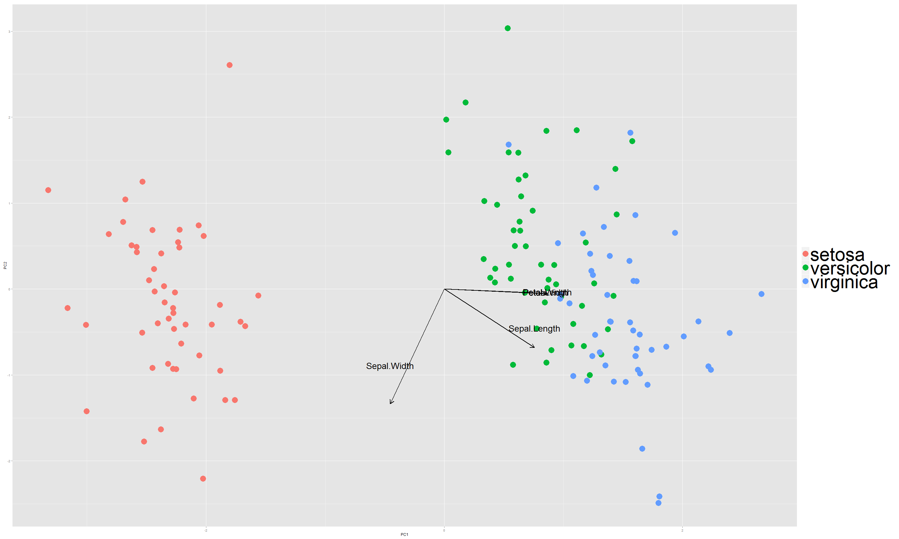
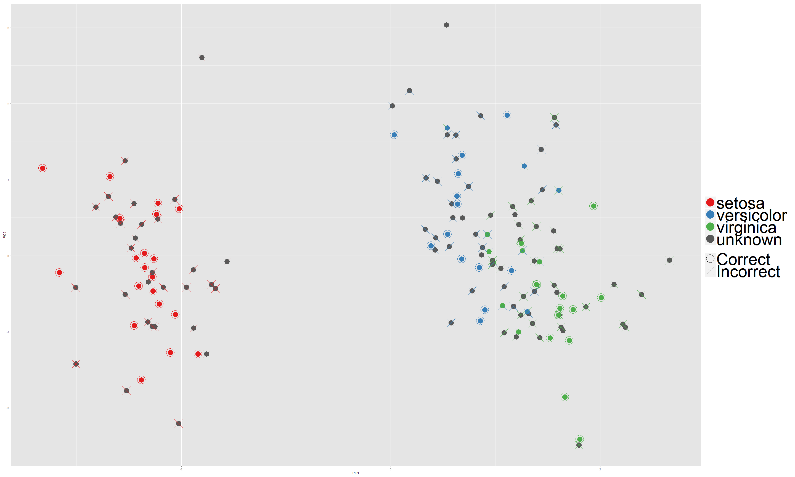

PCA and Random Forest Application on Data Iris
========================================================
author: Edwin Ng
date: December 14th, 2015
width: 1600
height: 1200
autosize: true
css: RPreCSS.css
transition: linear
navigation: slide 

PCA Transformation I
========================================================


* Let's check the data...


```
  Sepal.Length Sepal.Width Petal.Length Petal.Width Species
1          5.1         3.5          1.4         0.2  setosa
2          4.9         3.0          1.4         0.2  setosa
3          4.7         3.2          1.3         0.2  setosa
4          4.6         3.1          1.5         0.2  setosa
5          5.0         3.6          1.4         0.2  setosa
```
* Due to the non-negative feature, transform the numeric variables by logarithm first


```r
log.ir <- log(iris[, 1:4])
ir.species <- iris[, 5]

iris.pca <- prcomp(log.ir, center = TRUE, scale = TRUE)

iris.pca.dat <- data.frame(PC1 = iris.pca$x[, 1], 
                           PC2 = iris.pca$x[, 2], 
                           Class = as.character(ir.species))
```

* __print__ and __plot__ can be directly applied on the PCA object produced by __prcomp__ function
* Loadings and variance explained on each PC factors are printed and graphed


PCA Transformation II
========================================================

```
Standard deviations:
[1] 1.7124583 0.9523797 0.3647029 0.1656840

Rotation:
                    PC1         PC2        PC3         PC4
Sepal.Length  0.5038236 -0.45499872  0.7088547  0.19147575
Sepal.Width  -0.3023682 -0.88914419 -0.3311628 -0.09125405
Petal.Length  0.5767881 -0.03378802 -0.2192793 -0.78618732
Petal.Width   0.5674952 -0.03545628 -0.5829003  0.58044745
```

 

PCA Transformation III
========================================================
* To visualize, we only pick first 2 principal components: __PC1__ and __PC2__
* We can think of other variables are projected into the 2-dimension which explain the variance most...

 

Random Forest Classification I (ntree = 1)
========================================================
* When number of trees are low, we can see there is high variance and __unknown__ classes happen more frequently

 

Random Forest Classification II (ntree = 50)
========================================================
 

* Additional function: user can switch off the indication of correctness...
